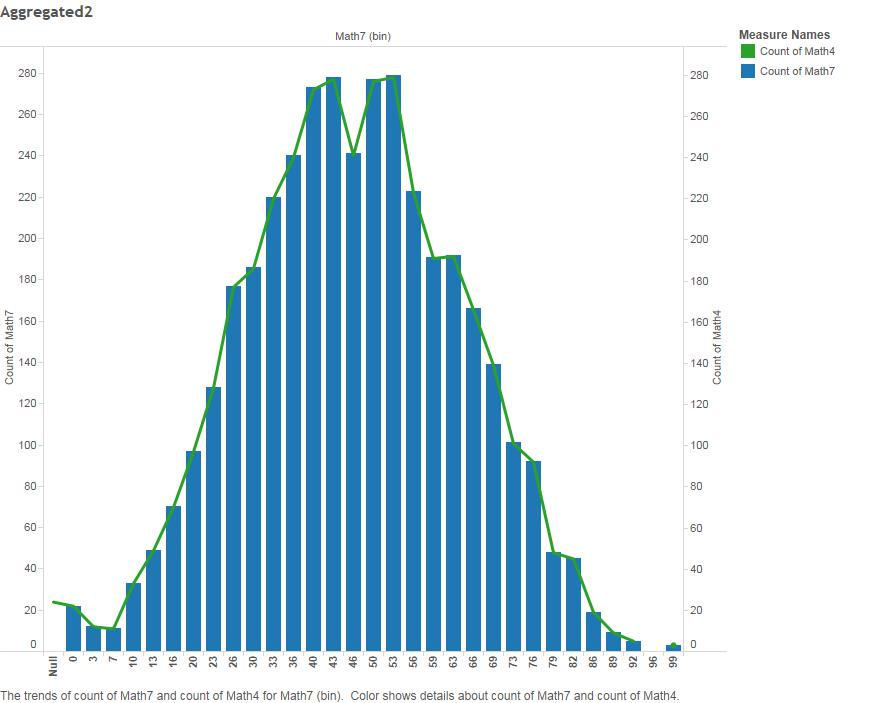
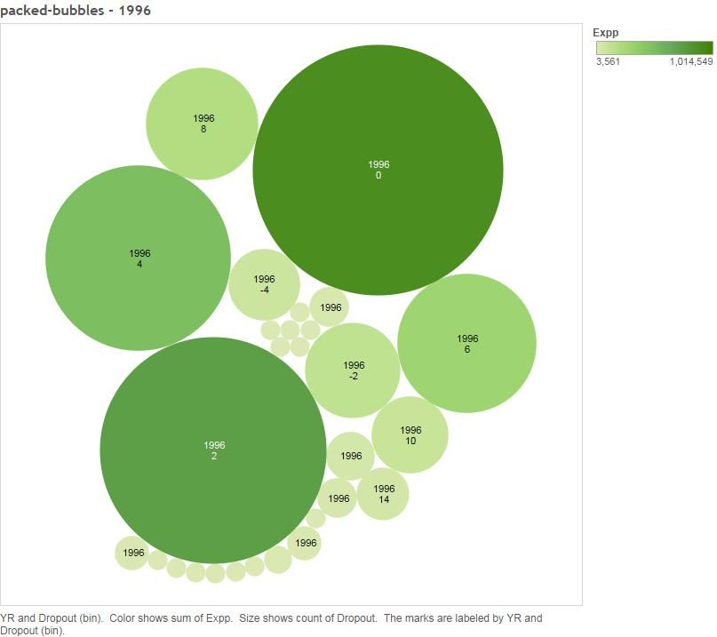
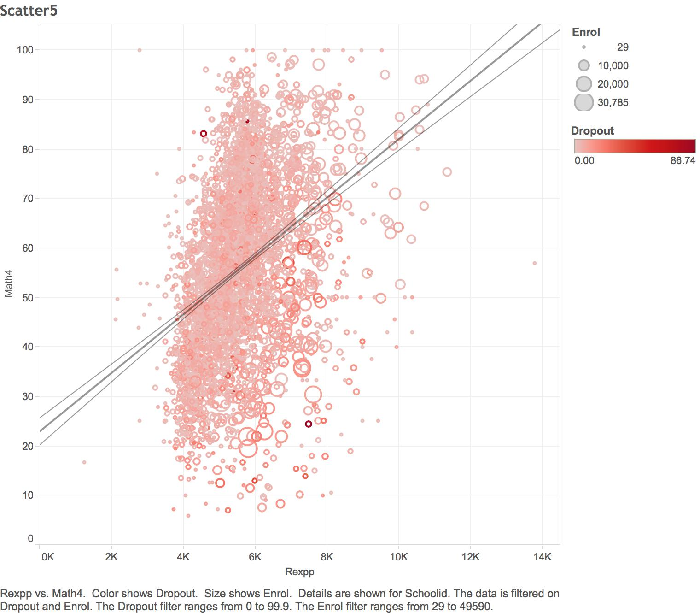

# Final Project

-----------------------------

## ETL

We sourced our data from Jeffrey Wooldridge's Econometrics dataset. During
the ETL process, we went through a two stage process. First, we had to
convert the original DTA file (originally for STATA consumption) into a CSV
using R's DTA reader. After we converted the DTA file into a CSV, we added
a school identifier to each record. Additionally, we split the dataset into
two tables: metrics and school information. We could have left our data
denormalized, but we chose to split the data in to two tables to practice
joining data in R and Tableau.

We used a modified version of the ETL_R Code provided by Dr. Cannata to extract the data
we wanted, and upload it to the oracle server. Fortunately, most of the data and column names
were well-behaved, and so there wasn't much work to do other than selecting the data we wanted
to use.

## Shiny Server

[The Shiny server where the visualizations are stored is located here](https://agent509.shinyapps.io/04Shiny)


## Non-Aggregated Visualization

We began with an attempt at a non-aggregated visualization. We used a box and whisker plot
to compare the distributions of grade 4 and 7 sccores, as well as the change in said scores, by year.


This chart shows some interesting trends. While the overall trend for "DeltaMath", which
acts as a measure of student improvement in math between the 4th and 5th grade, is down,
the overall math scores themselves tend to rise.

We found this visualization to be an interesting result, and so we included it among our Shiny
visualizations. We used ggplot's boxplot geom to generate 3 boxplots, and used grid.arrange from
gridExtra to stack them in a column.

## Aggregated Visualization

Next we tried our hand at some aggregated visualizations. First we attempted a dual-y-axis plot
using a histogram on the Dropout rate of high schools. On the second axis we plotted the average
expenditures per student for each bin. The visualization was paged by year.


Looking at the distribution shows that there is no real trend with how average expenditures
per student varies with dropout rate.

We thought this was interesting, and so decided to reproduce it with Shiny. As far as we
could find, ggplot provides no real native way to make dual-axis plots, and so we had to do
it by hand.

First we had to generate a workflow that would properly bin the data.

```
      df <- filter(df(),as.numeric(as.character(GRAD)) <= 100, as.numeric(as.character(DROPOUT)) >=0) %>% 
mutate(bin=floor((as.numeric(as.character(DROPOUT))/2)),DELTAMATH=as.numeric(MATH7)-as.numeric(MATH4)) %>% 
filter(as.numeric(as.character(YR))==years(),!is.null(bin)) %>% 
group_by(bin) %>% 
summarise(count=n(),avg=mean(as.numeric(as.character(EXPP))))
```

This workflow first filters out a couple of odd data points (negative graduation rates and graduation 
rates well over 100), then uses dplyr's "mutate()" function to create a bin column that will be 
used for binning. Then, the data is filtered according to the year given by the reactive slider in the UI.
Finally, dplyr is used to group the data according to the bin, and summarise into the count and average
expenditure fields used in the plot.

two plots are then created using the ggplot histogram and point geoms, and gtable is
used to merge the two plots into one dual-axis plot.

------------------------

Next we generated a plot to compare the distributions of the grade 4 and 7 math score distributions,
using a barchart for 7th grade, and line chart for 4th grade.



This visualization ultimately just shows that the score distributions are both about normal,
and both about the same. This isn't particularly unexpected or interesting.

--------------------------------
We created a packed bubble plot paged by year, using expenditure per pupil for color,
and dropout rate for size



This visualization shows the relationship between expenditure per pupil and dropcount, but
ultimately does not do so as well as other charts.

## Scatterplots

Given that our dataset consists mostly of measures, with only a few dimensions (many of which are linked),
Scatterplots are where most of the interesting data visualizations lie.

First we wanted to see the relationship betwen math scores and the % of students elligible for free lunches.
This could provide a useful way to see a correlation between math scores and economic status. So we 
plotted 3 scatterplots of grade 4 math scores vs lunch subsidies, grade 7 math scores vs lunch subsidies,
and deltamath scores vs lunch subsidies.


This plot shows a very clear negative correlation between math scores and % elligible for lunch,
suggesting a negative correlation between math performance and economic status. On the other hand,
there appears to be little to no correlation for change in test performance.

We found this plot interesting, and so recreated it in shiny, using a reactive slider to control
the confidence interval for the trendline. The trendline was generated using ggplots smooth geom

```
geom_smooth(method='lm',level=as.numeric(margin()))
```


---------------------

We wanted to use a scatterplot to compare dropout rate to expendetures per student in a more precise
way than was given by the histogram or the packed bubbles, so we made a scatterplot, also
including 7th grade math scores for the color of the points. The visualization was paged by year.


This visualization confirms what was suggested with the histogram: that there is no clear correlation
between a dropout rate and expenditures per student. We thought this result was interesting, and so we
recreated it in Shiny.

We used Shiny's reactive slider to allow the user to page the visualization by year, and also to
select the confident interval for the linear fit. The linear model was computed using the same method
as the previous scatterplot.

-----------------------------

We created a scatterplot to compare the size of a school with its dropout rate, and using Math4 for the color.


This plot shows an interesting positive correlation between enrollment and dropout rate. Larger
districts tend to have a higher dropout rate. We included this plot in Shiny as well. We used
reactive sliders to allow users to page by year and select the error margins of the linear fit.

----------------------------------

One more correlation we wanted to test using scatterplots was that of average teacher salary and math test
scores. We used a simple scatter plot like the previous couple to compare them.


While the correlation is not a strong one, there does indeed appear to be a positive correlation
between average teacher salary and math test scores. This chart was reproduced in Shiny in the same
manner as the previous one. Reactive was used to allow users to select the year as well as the error
margins.

----------------------------------

The last scatterplot we chose to produce is a bubble chart. We plotted expenditures per student against
grade 4 math scores. Enrollment was used for bubble size, and dropout rate for bubble color.



This plot shows a couple of interesting correlations. It shows a very clear positive correlation between
expenditures per person and grade 4 math scores. Looking at how the bubbles get bigger further to
the right shows how expenditures per student correlates positively with school size.

We thought this plot was interesting, so we recreated it in shiny. The aes mapping for ggplot used
dropout rate for color, and enrollment rate for size.

```
plot1 <- ggplot(df,aes(x=as.numeric(as.character(REXPP)),y=as.numeric(as.character(MATH4)),color=as.numeric(as.character(DROPOUT)),size=as.numeric(as.character(ENROL)))) +
  geom_point(shape=1) +
  labs(x="Expenditures Per Puplil",y="4th Grade Math Scores")
```

## Crosstab Visualization
Seeing as our data had so few dimensions, we didn't have much to work with in the way of crosstabs
and barcharts. We started with a crosstab for year and intermediate district, using deltamath
as the mark. We used a KPI for showing whether deltamath was positive or negative in a given year,
giving a rough measure of whether or not that district improves students math scores over time.


It's pretty clear that most districts have a negative deltamath value. There wasn't much more
to be done with this crosstab, and we didn't find it particularly interesting, so we chose to
exclude it from our shiny visualizations.

## Barchart Visualization

We tried a barchart on district ID for each of our math score metrics, plotting a reference line for
each.


Unfortunately, given there are over 3000 districts, this barchart is cumbersome, and not particularly
useful, so we saw no reason to include it in our Shiny visualization.
